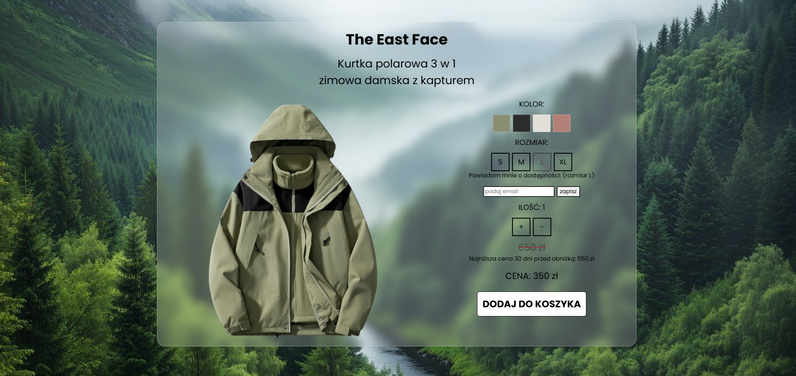

# Karta Produktu

## Opis Projektu

Ten projekt to implementacja **interaktywnej karty produktu e-commerce**. Głównym celem było pogłębienie praktycznej wiedzy z zakresu **HTML5, CSS3 oraz JavaScript**, skupiając się na budowie interfejsu i dynamicznej manipulacji DOM.

## Podgląd projektu



##  Technologie Wykorzystane

**HTML5** 
**CSS3** 
**JavaScript** 

##  Funkcjonalności

Projekt koncentruje się na opanowaniu następujących zagadnień:
1.  **Responsywność (CSS):**
    * Zapewnienie poprawnego wyświetlania układu na różnych szerokościach ekranu za pomocą zapytań **Media Queries**.
2.  **Obsługa Stanów (JavaScript):**
    * Dynamiczne oznaczanie aktywnego rozmiaru i koloru (dodawanie/usuwanie klas CSS).
    * **Zarządzanie stanem** ilości produktu (funkcje inkrementacji/dekrementacji).
3.  **Manipulacja Treścią (JavaScript):**
    * Zmiana głównego obrazu produktu w zależności od wybranego koloru.
    * Obsługa formularza powiadomienia (podstawowa walidacja pola e-mail).

## Instalacja i Uruchomienie

Aby uruchomić projekt lokalnie:

1.  **Sklonuj repozytorium:**
    ```bash
    git clone https://github.com/urbaniakmonika/karta_produktu.git
    ```
2.  **Przejdź do katalogu projektu:**
    ```bash
    cd nazwa-twojego-projektu
    ```
3.  **Uruchom:**
    * Otwórz plik `index.html` bezpośrednio w przeglądarce.

---

## Autor
urbaniakmonika